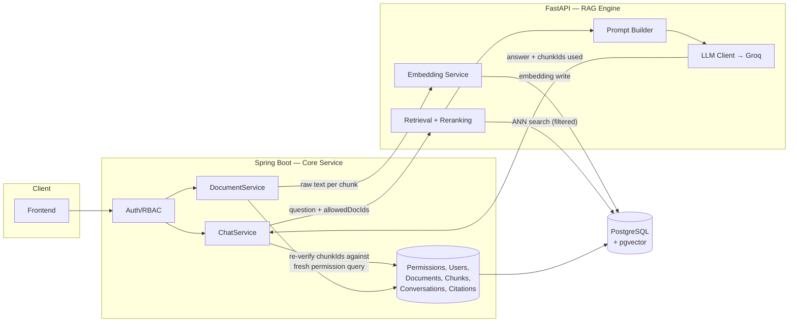

# DocuMind — Hybrid Architecture PRD
### Java (Spring Boot) + Python (FastAPI) RAG Service — Phased Implementation Plan

**Document purpose:** This PRD defines how DocuMind evolves from a Java-only monolith (current Phase 1) into a **hybrid, two-service architecture**, phased so each step is learnable, testable, and demo-able in isolation before it's wired into the whole system. It assumes the existing README as ground truth for what's already built.

---

## 1. Why hybrid, and where the line is drawn

**Core principle:** Java keeps everything that is *system-of-record* and *security-critical*. Python owns everything that is *ML/RAG-specific*. The boundary is drawn so that **no authorization decision ever crosses into Python** — Python is a smart-but-untrusted retrieval/generation engine, not a gatekeeper. This preserves the defense-in-depth model your README already describes (pre-filter → search → re-fetch → re-verify) instead of weakening it.

| Stays in Java (Spring Boot) | Moves to Python (FastAPI) |
|---|---|
| Auth, JWT, RBAC (Phase 2 roadmap item) | Embedding generation |
| Document/User/Permission/Conversation entities (JPA, source of truth) | Vector similarity search against pgvector |
| Permission pre-filtering & **re-verification** (the real security gate) | Chunking strategy (naive → structure-aware → hybrid search) |
| File storage, upload handling, document lifecycle status | Reranking (cross-encoder) |
| Audit logging | LLM prompt construction & the actual LLM call |
| API gateway / BFF for the frontend | Evaluation & RAG-quality tooling (RAGAS, tracing) |
| Orchestrating calls to the Python service | OCR & multi-format parsing (Phase 7 roadmap item) |

**Why this split, not some other split:** the temptation is to move the *whole* read path to Python immediately. Don't — that's the piece where permission re-verification lives, and duplicating that logic in two languages against two connections to the same Postgres instance is how RBAC bugs get introduced. Instead, Java always computes `allowedDocumentIds` before calling Python, and Java always re-verifies the chunk IDs Python returns actually belong to that allowed set before it persists citations or returns an answer. Python never talks to the `document_permissions` table. Ever.

---

## 2. Target tech stack (Python side)

| Concern | Choice | Why |
|---|---|---|
| Web framework | **FastAPI** | Async-native, Pydantic validation, auto OpenAPI docs — the last part matters a lot for a clean internal contract with Java. |
| Server | **Uvicorn** (behind Gunicorn in prod) | Standard pairing with FastAPI. |
| Embeddings | Start with **sentence-transformers** (`all-MiniLM-L6-v2`, same model as now, so retrieval quality doesn't shift when you migrate) → later experiment with a stronger model (`bge-small-en-v1.5` or similar) now that you're not fighting ONNX-in-Java packaging. |
| Postgres/pgvector client | **psycopg3** (async) + raw SQL, or **pgvector-python** helper | Learn the direct client first before reaching for an ORM — you already have Hibernate managing schema in Java, so Python should treat `vector_store` as a table it queries, not owns. |
| LLM orchestration | Raw **Groq/OpenAI Python SDK** first (`llama-3.3-70b-versatile`, same as now) | Don't reach for LangChain/LlamaIndex immediately — write the retrieval-augmented prompt by hand once so you *understand* what those frameworks abstract away. Introduce LangChain or LlamaIndex explicitly in Phase 6 as a deliberate "now let's use the framework" step. |
| Reranking (Phase 6+) | **sentence-transformers CrossEncoder** (`ms-marco-MiniLM-L-6-v2`) | Small, local, no extra API key. |
| Data validation | **Pydantic v2** | Defines the request/response contract with Java explicitly — this doubles as living documentation. |
| Testing | **pytest** + **httpx** test client | Mirror what you already do with Spring's test slices. |
| Packaging | **uv** or **poetry** | Either is fine; `uv` is faster and increasingly standard — good resume signal either way. |
| Containerization | **Docker**, added to the existing `docker-compose.yml` alongside Postgres | Both services + DB come up with one `docker compose up`. |
| Inter-service auth | Shared internal API key / mTLS-lite via a header, validated by FastAPI middleware | Not JWT-per-user — Java has already authenticated the user; this is service-to-service trust, a different problem worth understanding as distinct from user auth. |
| Observability (Phase 7) | **Langfuse** (self-hostable, generous free tier) or simple structured logging first | Traces embedding time, retrieval time, LLM latency separately — critical once two network hops exist. |

**Communication protocol:** plain **REST/JSON** over HTTP for the whole plan. gRPC is a legitimate stretch goal (call it Phase 10+) but don't start there — REST keeps the contract debuggable with `curl`/Postman while you're still learning the Python side, and "why REST not gRPC here" is itself a fine interview answer (human-debuggable internal contract, low call volume, not perf-critical at this stage).

---

## 3. Target architecture (end state, after Phase 6)

**The one rule that must never be violated as this evolves:** every response Python returns is treated by Java as *untrusted and unverified* until Java cross-checks the referenced `chunkId`s against a fresh permission query. This is a straight extension of what `ChunkRetrievalService` already does today — you're just moving the *search* across a network boundary, not the *trust*.

---

## 4. Phased roadmap

Each phase below is designed to be buildable and demo-able **on its own**, with a clear "done" bar, before you touch the next one. Do them in order — each teaches one new thing instead of three at once.

---

### Phase 2 — Finish real auth in Java (no Python yet)
*(This is already on your roadmap — do it before starting the hybrid work, not in parallel with it.)*

**Goal:** Replace the permit-all `SecurityConfig` stub with real JWT auth + RBAC enforcement.

**Scope:**
- Spring Security + JWT (issue on login, validate on each request)
- Replace the single dev user with real `User` rows, password hashing (BCrypt)
- Wire actual `Authentication` into `ChunkRetrievalService` instead of the hardcoded dev user
- Basic `POST /auth/register`, `POST /auth/login`

**Why first:** Everything downstream depends on `allowedDocumentIds` being computed from a *real* authenticated user. Building the Python service against a fake auth model means re-testing everything once Phase 2 lands. Do it once, correctly, first.

**Exit criteria:** Two different users, two different permission sets, verifiably get different retrieval results through `/chat`.

---

### Phase 3 — Extract an "Embedding & LLM Gateway" microservice (smallest possible first cut)

**Goal:** Stand up FastAPI as a real, running, Dockerized service — but give it the *smallest* possible responsibility: take text in, return an embedding vector out. And separately: take a prompt in, return an LLM completion out. No vector store access yet. No retrieval logic yet.

**Scope (Python):**
- `POST /embed` — `{ "text": "..." }` → `{ "embedding": [0.123, ...], "model": "all-MiniLM-L6-v2", "dim": 384 }`
- `POST /embed/batch` — same, list in/out (you'll need this immediately for chunk ingestion)
- `POST /generate` — `{ "system": "...", "messages": [...] }` → `{ "content": "...", "model": "...", "usage": {...} }`, calling Groq directly
- Pydantic models for both, FastAPI's auto-generated `/docs` as your contract reference
- Dockerfile + add to `docker-compose.yml`
- pytest tests that hit the endpoints directly (no Java involved) — this is the "build it in isolation" step

**Scope (Java):**
- `ChunkIngestionService` calls `POST /embed/batch` via `RestClient`/`WebClient` instead of the local ONNX bean
- `ChatService` calls `POST /generate` instead of the Spring AI `ChatModel` bean directly (you can keep Spring AI's `VectorStore` for now — that's Phase 4)
- Remove `spring-ai-starter-model-transformers` dependency once this is verified working end-to-end
- Simple internal API key header (`X-Internal-Api-Key`) checked by both sides

**What you'll actually learn here:** FastAPI project structure, Pydantic, async endpoints, Docker networking between two containers + Postgres, and — importantly — what it feels like when a call that used to be an in-process method call becomes a network call (latency, timeouts, error handling for a downed service).

**Exit criteria:** Upload → index → ask → cited answer still works end-to-end, but embeddings and the LLM call now physically happen in a separate Python process. `docker compose up` brings up all three containers.

**Deliberately deferred to later phases:** vector search itself, chunking logic, prompt construction — all still Java. This phase is intentionally narrow.

---

### Phase 4 — Move vector search into Python

**Goal:** Python queries pgvector directly instead of Java's Spring AI `VectorStore` bean doing it.

**Scope (Python):**
- `POST /retrieve` — `{ "query": "...", "allowed_document_ids": ["uuid", ...], "top_k": 5 }` → `{ "results": [{ "chunk_id": "...", "document_id": "...", "score": 0.83 }, ...] }`
- Internally: embed the query (reuse Phase 3's embedding logic), run a filtered ANN query against `vector_store` using **psycopg3 directly** — write the raw `SELECT ... ORDER BY embedding <=> %s LIMIT %s` yourself once so you understand what pgvector's operators (`<=>` cosine, `<->` L2) actually do, before any framework hides it
- This is the step that directly fixes "pgvector felt rough" — you get a Python-native async connection pool (`psycopg_pool` or `asyncpg`) talking to pgvector with none of Spring AI's abstraction in the way

**Scope (Java):**
- `ChunkRetrievalService.retrieve()` now: (1) computes `allowedDocumentIds` as before, (2) calls `POST /retrieve` with that list, (3) re-fetches `DocumentChunk` rows by the returned `chunkId`s, (4) **re-verifies** permissions on those exact rows — this step is unchanged from your current design, just now operating on chunk IDs that arrived over HTTP instead of from an in-process `VectorStore` call
- Remove the `spring-ai-starter-pgvector-store` dependency and the Spring AI `VectorStore` bean once verified

**Exit criteria:** Revoke a permission mid-conversation and confirm (as your README already claims for the Java-only version) that a subsequent question still can't surface that document's chunks — now proving the re-verification step holds even with retrieval happening in a different process/language.

---

### Phase 5 — Move prompt construction + full read-path orchestration into Python

**Goal:** Python owns the actual RAG assembly: build the grounded prompt (system rules + numbered context + question) and call the LLM, returning the finished answer plus which chunks it used. Java becomes a thinner orchestrator for the read path.

**Scope (Python):**
- `POST /rag/query` — `{ "question": "...", "allowed_document_ids": [...], "top_k": 5 }` → `{ "answer": "...", "used_chunk_ids": ["...", ...], "no_context_found": false }`
- Internally chains: retrieve (Phase 4 logic) → build the grounded prompt (port your existing system prompt rules exactly) → call Groq (Phase 3 logic) → parse which numbered sources the model actually cited → return
- If retrieval returns zero chunks, return `no_context_found: true` **without calling the LLM** — same hallucination guard as today, just implemented on the Python side now

**Scope (Java):**
- `ChatService.ask()` shrinks to: persist user message → compute `allowedDocumentIds` → call `/rag/query` → **re-verify every `used_chunk_id` against a fresh permission query** (non-negotiable, same as Phase 4) → persist assistant message → `CitationService` records citations from the (now-verified) chunk IDs → return

**This is the phase where the architecture in Section 3 is fully realized.** From here on, Python is a genuine RAG engine and Java is a genuine gateway/system-of-record.

**Exit criteria:** Full README write-path and read-path both work with Python as the RAG brain; a deliberately malformed/forged `chunk_id` from a stubbed Python response is still rejected by Java's re-verification (write a test that proves this — it's your best interview story about the security model surviving a service split).

---

### Phase 6 — RAG quality improvements (Python-native strengths)

**Goal:** Now that Python owns retrieval end-to-end, use this phase to fix the things naive fixed-window chunking and pure vector search leave on the table — this maps to your existing roadmap Phase 3 ("smarter chunking") but is naturally a Python job.

**Scope:**
- Structure-aware chunking: swap the 200-word sliding window for a text splitter that respects headings/sentences/tables — either hand-roll it or introduce **LangChain's `RecursiveCharacterTextSplitter`/`MarkdownHeaderTextSplitter`** here as your first deliberate use of a RAG framework
- Hybrid search: add BM25 (`rank_bm25` or Postgres full-text search) alongside vector search, combine with reciprocal rank fusion
- Reranking: run the top ~20 hybrid candidates through a CrossEncoder, keep the top `k`
- A/B this against Phase 5's plain vector search on a small hand-built eval set (10–20 question/expected-answer pairs) so you can *show* the improvement, not just assert it

**Exit criteria:** A short written comparison (retrieval precision/quality before vs. after) — this becomes a genuinely strong resume bullet and interview talking point.

---

### Phase 7 — Observability across the service boundary

**Goal:** Once a request touches two processes, "why was this slow" and "why was this wrong" both get harder to answer without tracing.

**Scope:**
- Structured logging with a shared `requestId`/`correlationId` propagated from Java → Python (pass it as a header, log it on both sides)
- Langfuse (or similar) tracing around retrieval, reranking, and the LLM call specifically, so you can see time-per-stage
- Basic RAGAS-style evaluation metrics (faithfulness, context precision/recall) on your eval set from Phase 6

**Exit criteria:** You can point to a single trace and say exactly where 80% of a slow request's latency went.

---

### Phase 8 — Streaming responses end-to-end

**Goal:** Replace the blocking `/chat` call with token-by-token streaming, matching how production chat UIs actually behave.

**Scope:**
- Python: `/rag/query/stream` using FastAPI's `StreamingResponse` + Groq's streaming API
- Java: consume the stream (Spring's `WebClient` supports SSE/streaming) and re-expose it to the frontend, likely via SSE
- Tricky part worth learning deliberately: citations/used-chunk-ids only exist *after* generation finishes, so you'll design a stream that ends with a final structured "metadata" event — a real pattern used in production chat APIs

**Exit criteria:** The tester UI shows tokens appearing incrementally, with citations arriving once the stream closes.

---

### Phase 9 — OCR & multi-format ingestion (your existing roadmap Phase 7, now natural in Python)

**Goal:** Handle scanned/image PDFs and DOCX/XLSX/PPTX — this was always going to be painful in the JVM ecosystem; it's comparatively easy in Python.

**Scope (Python):**
- New `POST /parse` endpoint: given a file, return page-numbered text — using `pytesseract`/`unstructured` for OCR, and `unstructured` or format-specific libs for DOCX/XLSX/PPTX, replacing/augmenting PDFBox for the hard cases
- Java's `DocumentService` calls `/parse` instead of (or as a fallback alongside) `PdfParsingService` for the formats PDFBox can't already handle well

**Exit criteria:** A scanned PDF that previously indexed zero chunks now indexes successfully; a DOCX upload works end-to-end.

---

### Phase 10 — Production hardening

**Goal:** Make the two-service system deployable and resilient, not just "works on my machine."

**Scope:**
- Full multi-container `docker-compose.yml` (Java, Python, Postgres, optionally Redis actually wired in for caching embeddings/results)
- Retry/circuit-breaker on the Java→Python calls (Resilience4j) — what happens when the RAG service is down should be a defined behavior (e.g., graceful degradation message), not a 500
- Consider a message queue (RabbitMQ) for ingestion specifically: `DocumentService` publishes a "document uploaded" event, a Python worker consumes it and does parse→chunk→embed asynchronously, updating `Document.status` via a callback or a small status-write endpoint — this fixes the "chunk ingestion isn't fully atomic" trade-off your README already flags, and is a strong distributed-systems story for interviews
- Basic CI (GitHub Actions): lint + test both services on push
- Optional stretch: containerized deploy to a free-tier host (Fly.io/Render) for a live demo link on your resume

**Exit criteria:** The system survives the Python service restarting mid-conversation; ingestion survives a crash without silently losing a document (or at least fails loudly and recoverably, matching the "durably recorded FAILED status" principle already in your Phase-1 design).

---

## 5. API contract summary (Java ⇄ Python)

| Endpoint | Introduced | Direction | Purpose |
|---|---|---|---|
| `POST /embed`, `POST /embed/batch` | Phase 3 | Java → Python | Text in, embedding vector(s) out |
| `POST /generate` | Phase 3 | Java → Python | Prompt in, raw LLM completion out |
| `POST /retrieve` | Phase 4 | Java → Python | Query + allowed doc IDs in, ranked chunk IDs out |
| `POST /rag/query` | Phase 5 | Java → Python | Question + allowed doc IDs in, grounded answer + used chunk IDs out |
| `POST /rag/query/stream` | Phase 8 | Java → Python | Same as above, SSE-streamed |
| `POST /parse` | Phase 9 | Java → Python | File in, page-numbered text out |

Every endpoint that accepts `allowed_document_ids` treats it as **already computed by Java** — Python never queries `document_permissions` and never should. Every endpoint's output that references a chunk is **re-verified by Java** before it's trusted. Write this rule into your actual repo README once Phase 3 starts, the same way the current README documents the pre-filter/re-verify pattern.

---

## 6. Risks & mitigations

| Risk | Mitigation |
|---|---|
| Auth logic quietly duplicated/drifts into Python | Hard rule: Python has no DB credentials for `users`/`document_permissions` tables at all — give it a Postgres role with SELECT/INSERT only on `vector_store` (and later `document_chunks` for read, if needed) so it's *structurally* incapable of checking permissions, not just disciplined about it. |
| Network hop latency stacking (embed → retrieve → generate as separate calls) | Phase 5 collapses these into one `/rag/query` call so Java makes one round trip for the whole read path, not three. |
| Two services, two dependency ecosystems, more to maintain | Accept this consciously — it's the trade-off for the resume/learning value discussed earlier. Keep the contract (Section 5) small and versioned so the services can evolve independently. |
| Orphaned chunks (embedding write succeeds, relational write fails, or vice versa) across a network boundary | Same problem your README already flags for Phase 1, just now also possible across the service boundary — Phase 10's message-queue-based ingestion is the eventual real fix; until then, treat it as a known, documented trade-off exactly as your current README does. |
| Losing track of *why* each thing is in each language during an interview | Keep Section 1's table close — the "why" is the actual interview answer, more than the "what." |

---

## 7. Suggested pace

This is a learning project, not a sprint — but as a rough calibration: Phases 3–5 (the actual hybrid-ification) are the meaty ones and deserve the most unhurried attention, since that's where the Java↔Python boundary and the security model get proven out. Phases 6–9 are each a self-contained, resume-friendly feature you can pick up independently once the boundary is solid. Phase 10 is worth doing at least partially (Dockerize + basic resilience) even if you skip the message-queue stretch goal.