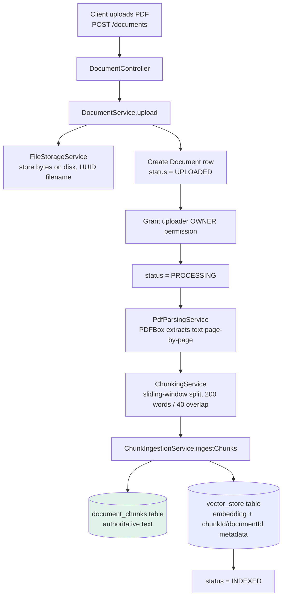
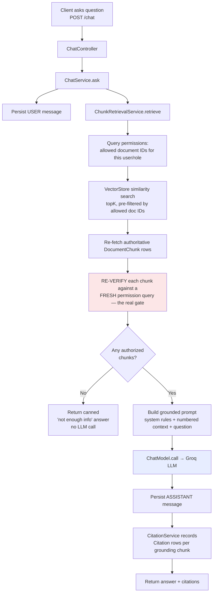
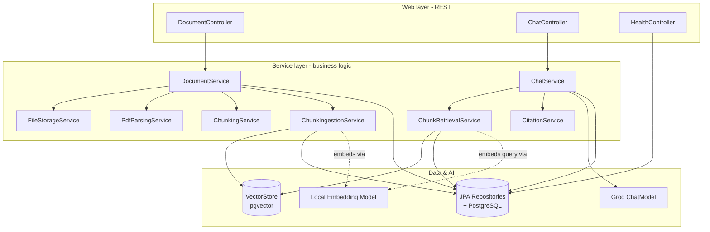
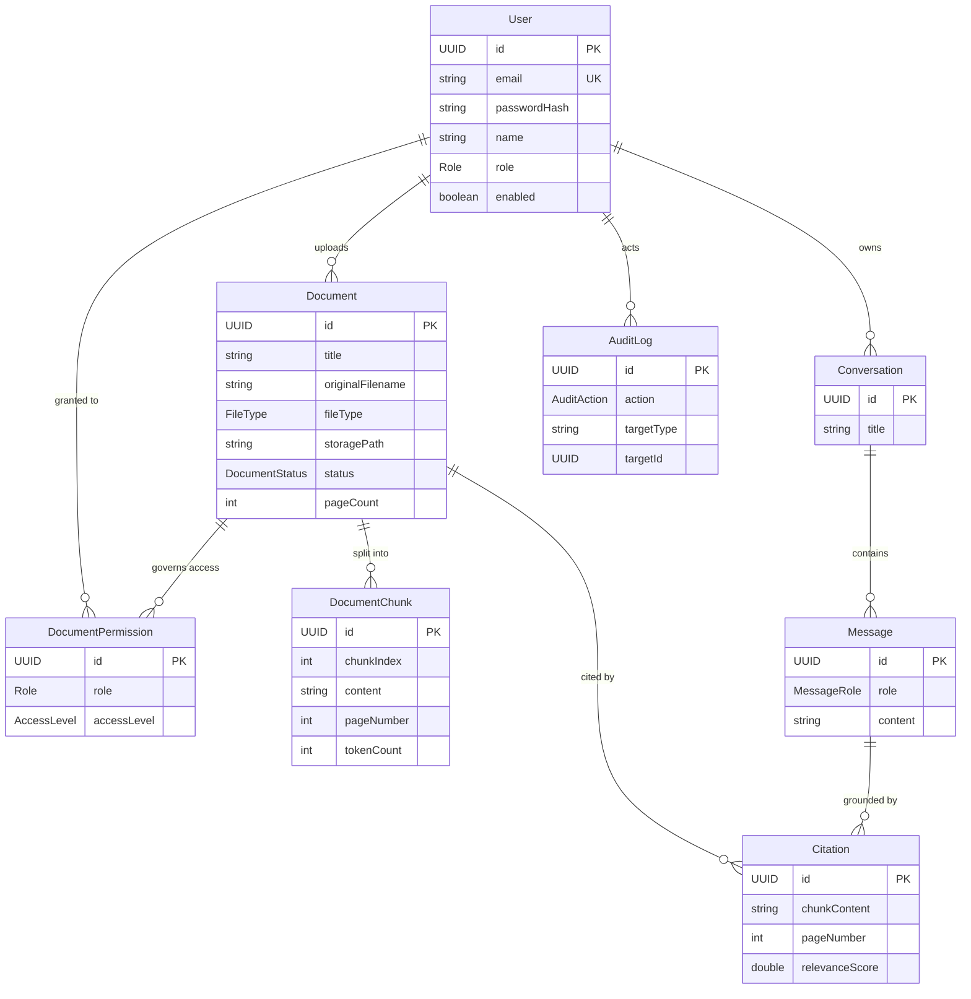

# DocuMind

> An enterprise **RAG (Retrieval-Augmented Generation)** knowledge assistant. Upload PDFs, then ask questions in natural language and get answers grounded **only** in your documents — every answer comes back with page-level citations, and access is gated per-user.

The application persona is called **Docent**. You upload documents, DocuMind parses them, splits them into chunks, embeds those chunks as vectors, and stores them. When you ask a question, it finds the most relevant chunks *you are allowed to see*, feeds them to an LLM as context, and returns a concise answer plus the exact source snippets it used.

This repository is currently at **Phase 1** — a working end-to-end vertical slice (upload → index → ask → cited answer) with authentication/RBAC still stubbed out. See the [Roadmap](#roadmap) for what each phase adds.

---

## Table of contents

1. [What problem it solves](#what-problem-it-solves)
2. [Tech stack](#tech-stack)
3. [How RAG works here (the two core flows)](#how-rag-works-here)
4. [Architecture & component dependencies](#architecture--component-dependencies)
5. [Data model](#data-model)
6. [The security model (why retrieval is done the way it is)](#the-security-model)
7. [Project structure](#project-structure)
8. [Getting started](#getting-started)
9. [API reference](#api-reference)
10. [Configuration](#configuration)
11. [Roadmap](#roadmap)

---

## What problem it solves

A plain LLM will confidently answer questions using its training data — which means it hallucinates about *your* internal documents, and it has no idea who is allowed to see what. DocuMind fixes both:

- **Grounding** — the model is only allowed to answer from text retrieved from your uploaded documents. If the answer isn't in the retrieved context, it says *"I don't have enough information"* instead of guessing.
- **Attribution** — every answer records **citations**: which document, which page, and the actual snippet used.
- **Access control** — retrieval is filtered by per-user/per-role permissions, so a user can never be shown a chunk from a document they aren't authorized to read (this is the design intent; enforcement wiring lands with real auth in Phase 2).

---

## Tech stack

| Layer | Technology | Why / notes |
|---|---|---|
| **Language / runtime** | Java 21 | Uses records, text blocks, modern APIs. |
| **Framework** | Spring Boot 4.1 | Web MVC, dependency injection, config, actuator. |
| **AI orchestration** | Spring AI 2.0 | `ChatModel`, `VectorStore`, embedding model abstractions. |
| **LLM (chat)** | Groq — `llama-3.3-70b-versatile` | Called via Groq's **OpenAI-compatible** endpoint, so the OpenAI starter is reused with a different base URL. |
| **Embeddings** | Local ONNX `all-MiniLM-L6-v2` (384-dim) | Runs **in-process** via `spring-ai-starter-model-transformers` — no API key, no network after the model is cached. Chosen because Groq has no embeddings API. |
| **Vector store** | PostgreSQL + **pgvector** (HNSW index, cosine distance) | Similarity search over the 384-dim embeddings. Spring AI owns and auto-creates the `vector_store` table. |
| **Relational DB** | PostgreSQL 16 | Source of truth for documents, chunks, users, permissions, conversations, citations. |
| **Persistence** | Spring Data JPA / Hibernate | `ddl-auto=update` — entities are the schema source of truth. |
| **PDF parsing** | Apache PDFBox 3.0.3 | Page-by-page text extraction (preserves page numbers for citations). |
| **Security** | Spring Security + OAuth2 Resource Server | Currently a permit-all stub; JWT/RBAC is Phase 2. |
| **Caching (declared)** | Spring Data Redis | Dependency present for later phases; not yet on the hot path. |
| **Boilerplate** | Lombok | Getters/setters/constructors on entities. |
| **Build** | Maven (wrapper included: `./mvnw`) | |
| **Local infra** | Docker Compose | Spins up the `pgvector/pgvector:pg16` database. |
| **Frontend** | Single static `index.html` (vanilla JS) | A minimal Phase-1 tester UI, served from `/`. |

> **Key architectural decision:** chat and embeddings use **two different providers**. Groq (remote) generates answers; a local ONNX model generates embeddings. Because both can't be the "OpenAI" bean at once, `OpenAiEmbeddingAutoConfiguration` is explicitly excluded in `application.properties` so there's exactly one `EmbeddingModel` bean (the local transformers one).

---

## How RAG works here

There are two paths through the system: the **write path** (ingesting a document) and the **read path** (answering a question). They meet at the vector store and the relational chunk table.

### Write path — uploading & indexing a document



Step by step:

1. **Upload** (`DocumentController` → `DocumentService.upload`) validates it's a PDF, reads the bytes.
2. **Store** the raw file on disk via `FileStorageService` (random UUID filename so uploads never collide). The path is saved on the `Document` row.
3. **Register** a `Document` row with status `UPLOADED`, then immediately grant the uploader an `OWNER` `DocumentPermission` (retrieval needs at least one permission row to return anything).
4. **Parse** (`PdfParsingService`) — PDFBox extracts text **one page at a time** so each piece of text keeps its page number. (Scanned/image-only PDFs yield empty text — OCR is deferred to a later phase.)
5. **Chunk** (`ChunkingService`) — a deliberately naive fixed-size **sliding window**: 200-word windows overlapping by 40 words, so context straddling a boundary isn't lost. Chunks never cross a page boundary, which keeps every chunk's page number exact.
6. **Ingest** (`ChunkIngestionService`) — two writes:
   - persist each chunk as a `DocumentChunk` row (the **source of truth** for content), then
   - hand the text to Spring AI's `VectorStore`, which embeds it (local ONNX model) and stores the vector plus `{chunkId, documentId}` metadata.
7. The document status advances `UPLOADED → PROCESSING → INDEXED` (or `FAILED` on any error — each status write is its own commit, so a failure is durably recorded).

### Read path — asking a question



Step by step (`ChatService.ask`):

1. **Persist the user turn** as a `Message` in a `Conversation` (a new conversation is created if none is supplied).
2. **Retrieve** authorized chunks via `ChunkRetrievalService.retrieve(query, user, topK)` — this is the RBAC-critical part (see [security model](#the-security-model)).
3. **Guard**: if no authorized chunks come back, return a fixed *"I couldn't find anything in your documents"* answer **without calling the LLM** — this is what prevents hallucination when there's nothing to ground on.
4. **Prompt & call**: otherwise, build a prompt = a strict system instruction (*answer only from context, cite the bracketed source numbers, don't guess*) + a numbered context block of the retrieved chunks + the question, and call the Groq `ChatModel`.
5. **Persist the assistant turn** and record a `Citation` for each grounding chunk (snapshotting the chunk text, document, page, and relevance score).
6. Return the answer + citations to the client.

---

## Architecture & component dependencies

The codebase is a classic layered Spring architecture: **Controllers (web) → Services (business logic) → Repositories (data) → Entities**. Services are the orchestrators; they depend on each other in a directed, acyclic way.



**Who depends on whom, and why:**

| Component | Depends on | Because |
|---|---|---|
| `DocumentController` | `DocumentService` | Turns an HTTP upload into the ingest pipeline. |
| `DocumentService` | `FileStorage`, `PdfParsing`, `Chunking`, `ChunkIngestion` services + repos | It's the **orchestrator** of the write path; it drives the status lifecycle. |
| `ChunkIngestionService` | `DocumentChunkRepository`, `VectorStore` | Writes the two representations of a chunk: relational row + embedding. |
| `ChatController` | `ChatService`, `MessageRepository` | Handles `/chat` and conversation history replay. |
| `ChatService` | `ChunkRetrievalService`, `CitationService`, `ChatModel`, repos | Orchestrator of the read path. |
| `ChunkRetrievalService` | `VectorStore`, `DocumentChunkRepository`, `DocumentPermissionRepository` | Does the permission-filtered similarity search + re-verification. |
| `CitationService` | `CitationRepository` | Persists which chunks grounded an answer. |
| `HealthController` | `JdbcTemplate` | Smoke-tests DB connectivity + pgvector presence. |

**The critical coupling — how the write and read paths stay consistent:**
`ChunkIngestionService` writes the `chunkId` into the vector store's metadata; `ChunkRetrievalService` reads that same `chunkId` back to map a vector hit to its authoritative `DocumentChunk` row. That shared metadata key (`ChunkIngestionService.META_CHUNK_ID`) is the contract linking the two halves of the system. The vector store is treated as a **fast index**, never as the source of truth — the relational `document_chunks` table is authoritative for content, and `document_permissions` is authoritative for access.

---

## Data model

All tables use UUID primary keys. Entities live in `com.fruity.documind.entity`.



**Plus one table you won't find as a JPA entity:** `vector_store`, created and owned by Spring AI's pgvector integration. It holds the embedding vectors and a JSONB metadata column (`{chunkId, documentId}`). It is used *only* as a retrieval index/pre-filter — never for authorization.

**Enums:**
- `Role`: `ADMIN`, `EDITOR`, `VIEWER`
- `AccessLevel`: `VIEW`, `EDIT`, `OWNER` (all imply read access)
- `DocumentStatus`: `UPLOADED` → `PROCESSING` → `INDEXED` / `FAILED`
- `FileType`: `PDF` (live), `DOCX`, `XLSX`, `PPTX` (reserved for later)
- `MessageRole`: `USER`, `ASSISTANT`
- `AuditAction`: `LOGIN`, `UPLOAD_DOCUMENT`, `QUERY`, `DELETE_DOCUMENT`, `PERMISSION_CHANGE`

**Design touches worth knowing:**
- A `Citation` **snapshots** the chunk text at citation time (not just a foreign key), so a past answer's citation stays accurate even if the document is later re-chunked or re-indexed.
- A `DocumentPermission` can be granted to a **specific user** *or* to a **role** — both are resolved together when computing what a user may access.

---

## The security model

Retrieval is written the way it is for one reason: **the vector store must never be the authorization decision.** Here's the defense-in-depth in `ChunkRetrievalService`:

1. **Pre-filter** — compute the set of document IDs the user may access (`DocumentPermissionRepository.findAccessibleDocumentIds`, which unions user-specific grants and role grants). If empty, skip the vector search entirely.
2. **Filtered similarity search** — run the pgvector search with a `documentId in [...]` filter. This is a *speed* optimization, not the security gate.
3. **Re-fetch authoritative rows** — map each vector hit back to its real `DocumentChunk` via the `chunkId` metadata.
4. **Re-verify** — run the permission query **again, fresh**, and drop any chunk whose document is no longer allowed. This means a permission revoked *after* the pre-filter was computed still blocks the chunk. Malformed metadata, orphaned vectors, and rows written outside the ingestion path are all silently discarded rather than trusted.

> Because there's no auth yet (Phase 1), every request is attributed to a single dev user (`dev@documind.local`, `ADMIN`) created on first use. Real JWT authentication and RBAC enforcement replace the `SecurityConfig` permit-all stub in Phase 2 — the retrieval gate above is already built to enforce it.

---

## Project structure

```
DocuMind/
├── docker-compose.yml            # local PostgreSQL + pgvector
├── .env.example                  # copy to .env, add GROQ_API_KEY
├── pom.xml                       # Maven build + dependencies
├── mvnw / mvnw.cmd               # Maven wrapper
└── src/main/
    ├── java/com/fruity/documind/
    │   ├── DocumindApplication.java     # Spring Boot entry point
    │   ├── config/
    │   │   └── SecurityConfig.java      # permit-all stub (temporary)
    │   ├── web/                         # REST controllers + DTOs
    │   │   ├── DocumentController.java   # POST/GET /documents
    │   │   ├── ChatController.java       # POST /chat, GET conversation history
    │   │   ├── HealthController.java     # GET /health
    │   │   ├── ChatDtos.java, DocumentResponse.java
    │   ├── service/                     # business logic (the orchestrators)
    │   │   ├── DocumentService.java      # write-path orchestrator
    │   │   ├── ChatService.java          # read-path orchestrator
    │   │   ├── PdfParsingService.java     # PDFBox text extraction
    │   │   ├── ChunkingService.java       # sliding-window splitter
    │   │   ├── ChunkIngestionService.java # persist chunk + embed
    │   │   ├── ChunkRetrievalService.java # RBAC-gated similarity search
    │   │   ├── CitationService.java       # record grounding sources
    │   │   └── FileStorageService.java    # local disk storage
    │   ├── entity/                      # JPA entities (8 tables)
    │   ├── repository/                  # Spring Data JPA repositories
    │   └── enums/                       # Role, AccessLevel, DocumentStatus, ...
    └── resources/
        ├── application.properties       # all config (DB, AI providers, RAG params)
        └── static/index.html            # minimal Phase-1 tester UI
```

---

## Getting started

### Prerequisites

- **Java 21** (JDK)
- **Docker** (for the PostgreSQL + pgvector database)
- A **Groq API key** — free at <https://console.groq.com/keys>

### 1. Start the database

```bash
cd DocuMind
docker compose up -d
```

This launches `pgvector/pgvector:pg16` on `localhost:5432` with database `documind` (user/password `postgres`/`postgres`). It has a healthcheck, so give it a few seconds. **Note:** host port 5432 must be free — stop any local PostgreSQL first.

### 2. Configure your API key

```bash
cp .env.example .env
# edit .env and set:
# GROQ_API_KEY=your_key_here
```

`.env` is git-ignored and loaded automatically by Spring (`spring.config.import`). Only the chat model needs a key — embeddings run locally.

### 3. Run the app

```bash
./mvnw spring-boot:run
```

On first run, Spring AI downloads and caches the local embedding model (`all-MiniLM-L6-v2`), and Hibernate + Spring AI create the schema (`document_chunks`, `vector_store`, etc.) automatically.

### 4. Verify & use

- **Health check:** `curl http://localhost:8080/health` → should report `database: UP` and a pgvector version.
- **Tester UI:** open <http://localhost:8080/> — upload a PDF, wait for `INDEXED`, then ask a question and see the cited answer.

### Run the tests

```bash
./mvnw test
```

Includes unit tests (chunking, PDF parsing, chat, document service) and integration tests for the full ingestion and chat flows.

---

## API reference

All endpoints are open in Phase 1 (no auth).

### `POST /documents` — upload & index a PDF
`multipart/form-data`: `file` (required, PDF), `title` (optional).
Returns `201` with the document view:
```json
{ "id": "…", "title": "…", "originalFilename": "handbook.pdf",
  "fileType": "PDF", "status": "INDEXED", "pageCount": 12, "createdAt": "…" }
```
`415` for non-PDFs, `400` for an empty file, `500` if the pipeline fails.

### `GET /documents` — list all documents
Returns an array of the document view above.

### `POST /chat` — ask a question
```json
{ "question": "How many vacation days do we get?", "conversationId": null }
```
`conversationId` is optional — omit/`null` to start a new conversation. Returns:
```json
{
  "conversationId": "…",
  "messageId": "…",
  "answer": "Employees receive 20 days [1] …",
  "citations": [
    { "documentId": "…", "documentTitle": "Handbook", "pageNumber": 7,
      "relevanceScore": 0.83, "snippet": "…first 240 chars of the source chunk…" }
  ]
}
```
Upstream LLM errors (rate limits, timeouts) surface as `502` with a readable message.

### `GET /conversations/{id}/messages` — replay history
Returns the conversation's turns in order (`role`, `content`, `createdAt`).

### `GET /health` — smoke test
Reports web/DB/pgvector status.

---

## Configuration

Everything is in `src/main/resources/application.properties`. The knobs you'll most likely touch:

| Property | Default | What it controls |
|---|---|---|
| `documind.retrieval.top-k` | `5` | How many chunks to retrieve per question. |
| `documind.chunking.size-words` | `200` | Words per chunk. |
| `documind.chunking.overlap-words` | `40` | Overlap between adjacent chunks. |
| `documind.storage.location` | `storage` | Where uploaded files are written. |
| `spring.ai.openai.chat.options.model` | `llama-3.3-70b-versatile` | The Groq chat model. |
| `spring.ai.openai.base-url` | Groq's URL | Point at any OpenAI-compatible chat provider. |
| `spring.ai.vectorstore.pgvector.dimensions` | `384` | **Must** match the embedding model's output size. |
| `spring.servlet.multipart.max-file-size` | `25MB` | Upload size limit. |

Secrets (`GROQ_API_KEY`) come from `.env` locally or real OS environment variables in production (real env vars take precedence — standard 12-factor).

---

## Roadmap

The code is written in phases; comments throughout reference these:

| Phase | Scope | Status |
|---|---|---|
| **0** | Infra bootstrap — PostgreSQL + pgvector, `/health` smoke test. | ✅ Done |
| **1** | Vertical slice — PDF upload → parse → chunk → embed → index, and grounded, cited Q&A. | ✅ **Current** |
| **2** | Real auth — JWT, login/register, roles, and RBAC enforcement (replaces the `SecurityConfig` stub). | Planned |
| **3** | Smarter chunking — structure-aware (headings, sentences, tables) instead of fixed windows. | Planned |
| **7** | OCR (Tesseract) for scanned PDFs + multi-format ingestion (DOCX/XLSX/PPTX via Apache POI). | Planned |

**Known Phase-1 trade-offs (deliberate):**
- No auth — every request is the single dev user.
- Naive word-based chunking; `tokenCount` is an estimate (~4 chars/token), not a real tokenizer.
- Chunk ingestion isn't fully atomic across the JPA write and the vector-store write — a crash between them can orphan a chunk (row exists, no embedding). The delete/cleanup path is responsible for reconciling orphans; the read path already ignores orphaned/malformed vectors.
- Image-only/scanned PDFs index with zero chunks until OCR arrives.
```
